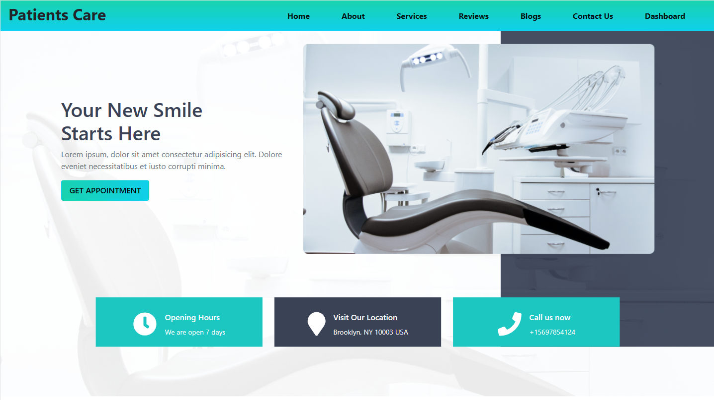

# Patient Care

# Features 
- Complete web application with a dynamic appointments, prescription and dashboard.
- Patient can make appointment and see his/her prescription.
- Doctor can give prescription, change status of the appointment.
- Doctor can add another doctor and can see the pending, todays and total appointment in the dashboard.
- Firebase Authentication & hosting are also included. 
- use default admin access with email default77@admin.com and #dev2021.

# Technology
- HTML5
- CSS3
- Bootstrap5
- JavaScript
- React 
- Firebase
- Node JS
- Express JS
- MongoDB
https://youtu.be/_f6vysAKOAw

###  `Website Demo Video :` [YouTube](https://patients-care-ec054.web.app/)
###  `Website Link :` [Live Site](https://patients-care-ec054.web.app/)
###  `Server Repo Link :` [Github](https://github.com/naeemmahmud70/patients-care-server)
